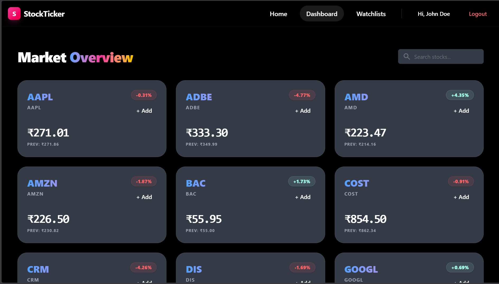

---

# StockTicker

A full-stack stock tracking application built to understand **end-to-end system design**, backend fundamentals, and frontend–backend integration.
This project focuses on **ownership and correctness**, not feature bloat or UI polish.

---




## Why This Project

I built **StockTicker** to move beyond isolated frontend or backend demos and work on a single system where:

* I design APIs instead of consuming mock data
* I manage real frontend–backend contracts
* I handle authentication, async flows, and error cases
* I learn backend concepts by **using them inside a working system**

The goal was not completeness, but **depth and explainability**.

---

## Tech Stack

### Frontend

* React (Vite)
* JavaScript
* Axios
* React Router
* Context API (authentication & global state)

### Backend

* Node.js
* Express
* PostgreSQL
* Prisma ORM
* JWT-based authentication

### External Services

* **Finnhub API** — real stock market data
* **Vercel** — frontend deployment
* **Microsoft Azure (PaaS)** — backend deployment
* **Supabase** — PostgreSQL database

### Testing

* Vitest
* Supertest
* React Testing Library
  (Tests focus on API behavior and user-visible UI flows only)

---

## Live Deployment

* **Frontend:** [https://stock-ticker-eta.vercel.app/](https://stock-ticker-eta.vercel.app/)
* **Backend API:** [https://stockticker-api-harsh-fbh8heb7dxc0cvcn.southeastasia-01.azurewebsites.net](https://stockticker-api-harsh-fbh8heb7dxc0cvcn.southeastasia-01.azurewebsites.net)
* **Database:** Supabase (PostgreSQL)

---

## Repository Structure

This is a **monorepo** with a clear separation between frontend and backend.

```
stockTicker/
├── client/        # React frontend
├── server/        # Node + Express backend
├── docs/          # Notes and design references
├── package.json   # Root scripts
└── README.md
```

Frontend and backend have independent dependencies and can be developed or tested separately.

---

## Backend Architecture

The backend uses an **MVC-style architecture** with an additional **service layer** to keep responsibilities clear.

```
server/
├── app.js          # Express app (middleware, routes)
├── server.js       # Server entry point
├── routes/         # Route definitions
├── controllers/    # HTTP request/response logic
├── services/       # Business logic and data access
├── prisma/         # Prisma schema and migrations
├── middleware/     # Auth and error handling
├── utils/          # Shared utilities
├── schemas/        # Validation schemas
└── tests/          # API and integration tests
```

### Design Choices

* `app.js` and `server.js` are separated to simplify testing
* Controllers remain thin and delegate logic to services
* Services handle database access and external API calls
* Centralized error-handling middleware
* Environment variables for secrets and configuration
* Clear separation between routing, logic, and data

This structure made refactoring and debugging significantly easier.

---

## Core Features

### Authentication

* User signup and login
* Password hashing
* JWT-based stateless authentication
* Protected routes using middleware

### Stock Data

* Fetches real market data from **Finnhub API**
* Individual stock detail views
* Error handling for invalid symbols and API failures

### Watchlist

* User-specific watchlists
* Add/remove stocks
* Access control enforced at API level

### API Design

* RESTful endpoints
* Consistent JSON responses
* Proper HTTP status codes
* Input validation and defensive error handling

---

## Frontend Overview

The frontend is a React SPA focused on **state management and correctness**.

Key aspects:

* Controlled forms for authentication
* Context API to manage auth state and navbar updates
* Protected routes (dashboard accessible only when logged in)
* Loading and error states for all async operations
* Axios interceptors for attaching auth tokens to requests

---

## Testing Approach

Testing was intentionally scoped to **high-signal cases**.

### Backend

* API route behavior
* Authentication failures
* Validation and error responses
* Database interactions via Prisma

### Frontend

* User-visible state transitions
* Loading and error states
* Authentication flow behavior

UI styling, component internals, and snapshot tests were intentionally not included.

---

## Deployment

* Frontend deployed on **Vercel**
* Backend deployed on **Microsoft Azure**
* PostgreSQL hosted on **Supabase**
* Environment variables configured for:

  * Database connection
  * JWT secrets
  * Finnhub API key

Deployment was kept simple to focus on application behavior rather than infrastructure complexity.

---

## What I Learned

* How frontend assumptions break when backend contracts change
* Why consistent API error formats matter
* How authentication impacts frontend architecture
* How to debug async issues across the stack
* Why separating controllers and services improves maintainability

Most of these lessons came from bugs and refactors, not tutorials.

---

## Out of Scope (Intentionally)

* Advanced security hardening
* Performance optimization
* WebSockets / real-time infrastructure

These were deferred to keep the project focused and explainable.

---

## How to Run Locally

### Backend

```bash
cd server
npm install
npm run dev
```

### Frontend

```bash
cd client
npm install
npm run dev
```

Environment variables are required for database access, JWT secrets, and the Finnhub API key.

---

## Status

This project is **complete for V1** and serves as a learning and portfolio project.
Future improvements may include refactoring, additional tests, or extended features, but the current version represents full end-to-end ownership.
