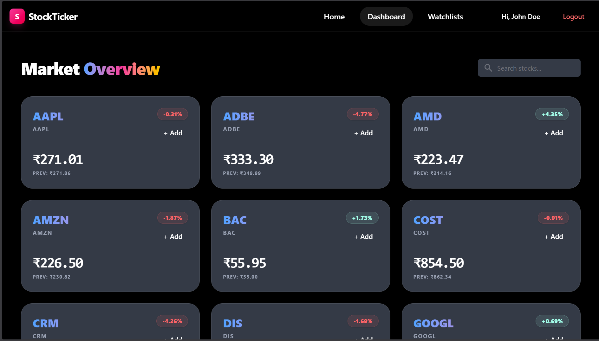

# StockTicker

A full-stack stock tracking application built as a study in **end-to-end system design** — multi-service backend, real-time data flow, container orchestration, and frontend integration.



## Architecture

Five containers under Docker Compose: an auth service, a main API, a market-data worker, Postgres, and Redis. The frontend is a React SPA that consumes both the REST surface and a Socket.io stream for live prices.

```
┌──────────────┐                                  ┌──────────────────┐
│   Frontend   │  ◀───── Socket.io (WebSocket) ───│                  │
│  (React +    │                                  │   Main API       │
│   Vite)      │  ──────── REST /api/* ──────────▶│  (Express +      │
└──────────────┘                                  │   Socket.io)     │
       │                                          └────┬────────▲────┘
       │ POST /api/auth/*                              │        │
       ▼                                  Prisma write │        │ PSUBSCRIBE
┌──────────────┐                                       ▼        │ market:prices:*
│ Auth Service │ ─── JWT (shared secret) ─────▶  ┌──────────────────┐
│  (Express)   │                                  │    Postgres      │
└──────┬───────┘                                  │  (shared DB)     │
       │ Prisma write                             └──────────────────┘
       ▼                                                          ▲
┌──────────────┐                                                  │ Prisma write
│   Postgres   │                                                  │
└──────────────┘                                  ┌──────────────────┐         ┌──────────┐
                                                  │  Market Data     │ PUBLISH │  Redis   │
                                                  │  Worker          │────────▶│ Pub/Sub  │
                                                  └──────────────────┘         └──────────┘
```

### Services

- **Auth Service** — Express on port `11000`. Owns `/api/auth/*`. Issues JWTs signed with `JWT_SECRET`.
- **Main API** — Express + Socket.io on port `10000`. Owns `/api/stocks/*` and `/api/watchlists/*`. Verifies JWTs from Auth via the shared secret. Subscribes to Redis `market:prices:*` and fans messages out to Socket.io rooms `prices:<symbol>`.
- **Market Data Worker** — standalone Node process. Polls a ticker list every 10s (60s in prod), upserts to Postgres, publishes one Redis message per ticker.
- **Postgres** — shared persistence. Auth, stocks, watchlists all live here; domains are isolated at the code level, not the DB level.
- **Redis** — Pub/Sub bus between Worker and API. Fire-and-forget — a missed tick is fine because the next one replaces it.

### Why these choices

- **Worker as a separate process** — polling can't stall the API request thread. Failure of the worker doesn't take down user-facing endpoints.
- **Pub/Sub, not BullMQ** — fire-and-forget matches live price semantics. BullMQ would be the right answer for an order-placement queue (durability + retries); here it's overkill.
- **Two Redis connections** (`getPublisher`, `getSubscriber` in `server/lib/redis.js`) — ioredis puts a client into one-way mode once `SUBSCRIBE` is issued; commands and subscriptions need separate sockets.
- **Auth as a separate service** — bounded scope and failure isolation. Coupling is just `JWT_SECRET`, not a runtime call.

## Tech Stack

**Frontend:** React 19, Vite 7, React Router 7, TanStack Query, Tailwind CSS 4, `socket.io-client`
**Backend:** Node.js 22, Express 5, Socket.io 4, ioredis 5, Prisma 7 (`@prisma/adapter-pg`), Zod, JWT
**Infra:** Docker Compose, multi-stage Dockerfile, non-root runtime, pinned image versions
**Testing:** Vitest, Supertest, React Testing Library

## Quickstart

```bash
git clone <repo>
cd stockTicker
docker compose up --build -d

# Frontend (separate terminal)
cd client && npm install && npm run dev
# Browser: http://localhost:5173
```

Ports: API `10000`, Auth `11000`, Postgres `5433` (host override), Redis `6380` (host override), Vite `5173`.

The worker defaults to `MOCK_PRICES=true` so the demo runs without a Finnhub key. To use live data, copy `.env.example` to `.env`, set `FINNHUB_API_KEY`, and set `MOCK_PRICES=false`.

## Live Deployment

- **Frontend:** [stock-ticker-eta.vercel.app](https://stock-ticker-eta.vercel.app)
- **Main API:** Azure Container Apps (`stock-api.graywave-83a9df4a.southeastasia.azurecontainerapps.io`)
- **Auth Service:** Azure Container Apps (`stock-auth.graywave-83a9df4a.southeastasia.azurecontainerapps.io`)
- **Database:** Supabase Postgres
- **Redis:** Upstash

## Repository Layout

```
stockTicker/
├── client/                       # React SPA
├── server/
│   ├── app.js, server.js         # Main API (Express + Socket.io)
│   ├── auth-service/             # Standalone Auth service
│   ├── worker/                   # Market data poller + Redis publisher
│   ├── lib/redis.js              # Shared ioredis publisher/subscriber factory
│   ├── controllers, routes, services, schemas, middleware, db, prisma
│   └── scripts/verify-realtime.mjs  # End-to-end Pub/Sub → Socket.io smoke check
├── docker-compose.yml            # Production-shape compose stack
├── docker-compose.override.yml   # Local-only: host ports for Postgres/Redis
└── .env.example
```

## Testing

```bash
cd server && npm run test:run     # 25 backend tests via Supertest
cd client && npm run test:run     # 11 frontend tests via React Testing Library
cd server && node scripts/verify-realtime.mjs   # end-to-end Socket.io smoke
```

Tests target API behavior, auth flows, data isolation between users, and the real-time pipeline. UI styling and snapshot tests are intentionally excluded.
